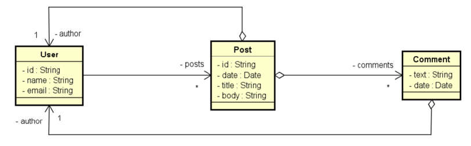

<h3>Workshop<h3>

<h4>API REST<h4>

Durante o projeto foram desenvolvidos:
* CRUD de Usuários
* CRUD de POSTS relacionados a comentários
* Tratamento de Exceções 
* Classes de configuração e conexão com o banco de dados MongoDB

Ferramentas e Bibliotecas utilizadas:
* Java 11
* Intellij IDEA Community Edition
* Postman para executar as requisições
* Banco de dados MongoDB (que é um banco NoSql)
* Spring-data-jpa para mapeamento das entidades
* MongoDB Compass (Para gerenciamento dos dados)

